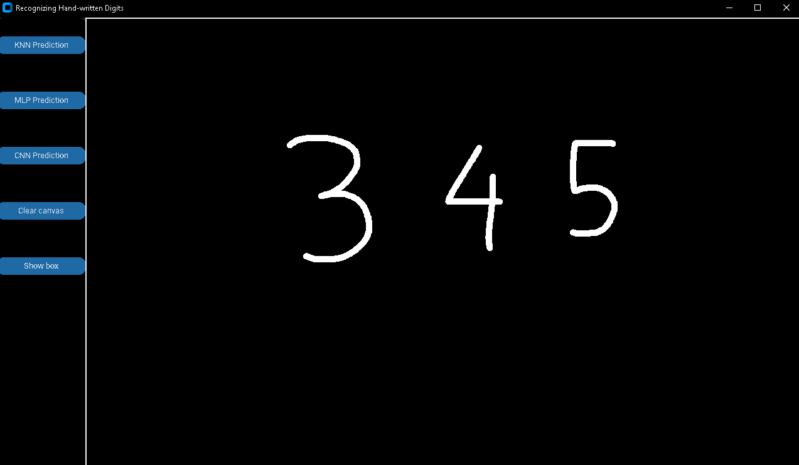
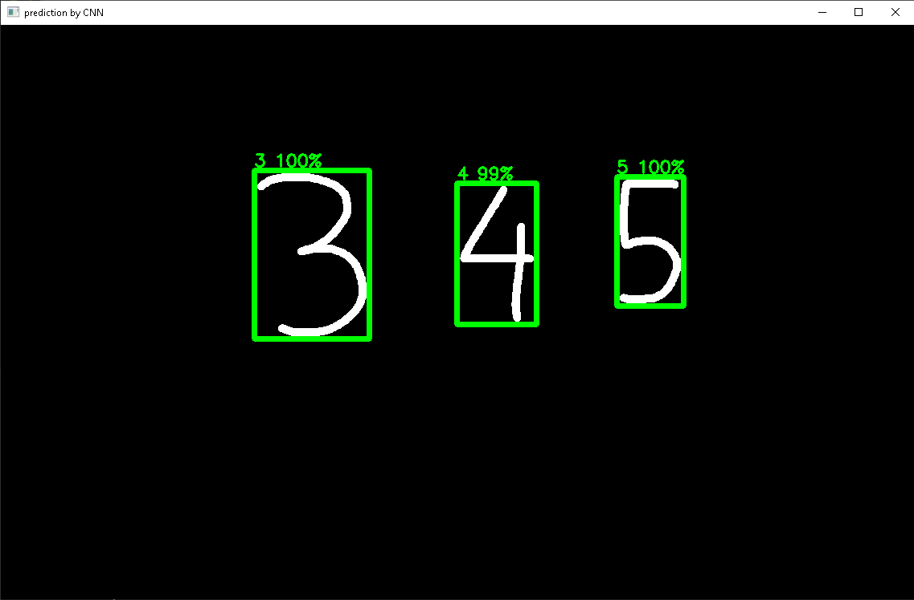

## handwritten-digit-recognition-system
Handwritten digits recognition system using K-nearest neighbors, Multilayer Perceptron, and Convolutional neural network.

## Features
The project will allow you to draw digits on the canvas using the computer's mouse. Then you will have three options to predict your drawn digits.

There will be 5 buttons. In which three buttons to predict digits using three different approaches. One button to clear canvas, and one to show the bounding box of each digit.

<p align="center">
  
  
  
</p>

<p align="center">
   <em>UI with digits drawn from computer mouse and prediction displayed</em>
</p>


## Requirement
To run this project, you must have Python version >= 3.5 installed. It is also highly recommended that you have Path Length Limit disabled. Which will avoid any issues when installing the necessary libraries to run the project.

## How to use: 
To use this project using git, please do the following.
* Firstly, clone the repository's main branch into your desired directory using your git command prompt.

```git clone -b main https://github.com/king17pvp/handwritten-digit-recognition-system.git```
* Secondly, you can access the directory by this command.

```cd handwritten-digit-recognition-system```

* Thirdly, install required libraries via requirement.txt

```pip install -q -r requirement.txt```
* Finally, run the project by 

```python main.py```

## Details about three implementations
All of the configurations that are implemented in this project were from our experimental notebook on Google Colab. Those .ipynb files were downloaded and uploaded here. You can review all the code and the output of those .ipynb files in [Experimental notebooks](https://github.com/king17pvp/handwritten-digit-recognition-system/tree/main/experiment_notebook) for more information.

### K-nearest neighbors
We will implement with Gaussian weight and sigma value = 2 with K = 7.

### Multilayer Perceptron
We will implement with 3 hidden layers of the size of each hidden layer respectively, is 512, 256, and 128.

### Convolutional Neural network

Implement using 2 convolutional-subsampling layers, 24 filters in the first layer, and 48 filters in the second layer. With one hidden fully connected layer of size 256 and an output layer size 10.

## Details about different codes
### preprocess_canvas.py

The code will be used to process the image grabbed from the drawing canvas, and then it will:
* Locate the bounding box of each digit
* Transform each digit into MNIST format (size (28, 28) and (, 784))
### knn.py
The code will implement a simple KNN algorithm with the selected properties mentioned above.

### feed_foward_model.py
The code will implement simple MLP with the trained weights from experiments.

